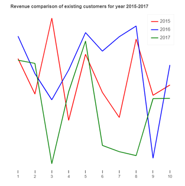
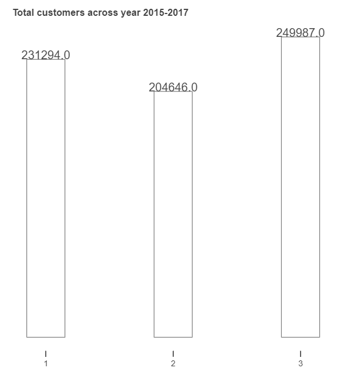

# Analysis-of-a-customer-net-revenue

Dataset Link (in dataset.zip too)

https://www.dropbox.com/sh/xhy2fzjdvg3ykhy/AADAVKH9tgD_dWh6TZtOd34ia?dl=0

The webpage is hosted on https://sapphire-kayla-37.tiiny.site/ (hosted on a website hosting platform which will expire within 7 days of this commit)

Visualization 1: Revenue comparison for the existing customers for all the three years. This visualization includes the top 10 existing customers data who were in the company for all the three years. 

Visualization 2: Total customers for the years 2015, 2016 and 2017

